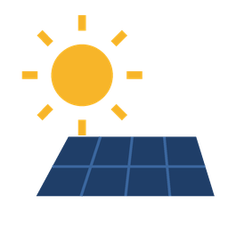

<div align="center">
  

  # Advanced Solar-Log

  **Every value from your Solar-Log system in Home Assistant — including the ones the official plugin leaves out.**

  [![Status: Work in Progress][wip-badge]](#status)
  [![Version][version-badge]][releases]
  [![HACS: Custom][hacs-badge]][hacs]
  [![Validate][validate-badge]][validate]
  [![License: MIT][license-badge]][license]
</div>

---

## Status

> [!WARNING]
> **Work in Progress — version 0.1.7.**
> This integration now runs against a real Home Assistant instance and a real
> Solar-Log, on top of the automated tests and Home Assistant's own checks
> (`hassfest`). It has not been through a long stretch of daily use yet.
>
> Expect rough edges, and please report them as an [issue][issues].
> **Version 1.0.0 lands once production use is confirmed.**

This integration talks to your Solar-Log device directly, over its own JSON
interface (`/getjp`) on the local network. It reads the values the official
Solar-Log plugin exposes plus **battery power and state of charge**, which the
official plugin leaves out.

The integration is entirely local: no cloud service, no other device in the
loop, no YAML configuration.

## Why this integration

| | Official Solar-Log plugin | Advanced Solar-Log |
|---|---|---|
| Production, consumption, grid | ✅ | ✅ |
| **Battery power and state of charge** | ❌ | ✅ |
| **Grid consumption and return to grid, without a separate meter** | ❌ | ✅ |
| Daily and total counters for the Energy dashboard | partial | ✅ |
| Self-consumption | ❌ | ✅ |
| Per-inverter power and yield | ❌ | ✅ |
| Setup through the UI | ✅ | ✅ |

## Entities

### Power

| Entity | Unit | Note |
|---|---|---|
| Production | W | current AC output |
| Consumption | W | current household consumption |
| Grid | W | positive = import, negative = feed-in (derived) |
| **Battery power** | W | positive = charging, negative = discharging |
| **Battery level** | % | |

Voltage and DC power are also available, disabled by default.

### Energy

Yield and consumption for today, yesterday, this month, this year and total,
in Wh, plus this year's self-consumption and this year's **grid consumption
and return to grid**. The counters that reset (today, this month, this year,
total) are declared `total_increasing`, so they work directly in the Energy
dashboard.

### Per inverter

When more than one inverter is detected, each one gets its own device with
its current power and this year's yield.

> Battery and per-inverter entities are only created when the Solar-Log
> actually reports them — an installation without a battery gets no empty
> entities, and reading them needs the device's web password (see
> [Setup](#setup)).

## Installation

This is a custom integration, not an official Home Assistant plugin, so it
does not ship with Home Assistant and is not in the default HACS store list.
It needs [HACS](https://hacs.xyz) installed first (Settings → Devices &
services → Add integration → "HACS", if you don't have it yet — see the
[HACS download guide](https://hacs.xyz/docs/use/download/download/)).

### Via HACS

[![Add repository to HACS][my-hacs-badge]][my-hacs]

Click the button above to open this repository directly in HACS on your own
Home Assistant instance, then **Download**. Or by hand: HACS → Integrations
→ ⋮ → **Custom repositories** → add
`https://github.com/janikbachmann/ha-advanced-solarlog` as an *Integration*,
then install "Advanced Solar-Log".

Either way, **restart Home Assistant** afterwards -- a new integration is
only picked up after a full restart, not a reload.

### Manually

Copy the `custom_components/advanced_solarlog/` folder into Home Assistant's
`config/custom_components/` directory and restart.

## Setup

[![Add integration][my-config-badge]][my-config]

Or: **Settings → Devices & services → Add integration → "Advanced
Solar-Log"**.

| Field | Value |
|---|---|
| Host | the Solar-Log's host name or IP address |
| Port | `80` |
| Password | the device's own web password — leave empty if none is set |

Without a password only production, consumption and the energy counters are
available; battery, self-consumption and per-inverter values sit behind the
device's login and stay unavailable until a password is set.

The **poll interval** (default 60 seconds) can be changed afterwards under
*Configure*. The **host and password** can be changed afterwards under
*Devices & services → Advanced Solar-Log → ⋮ → Reconfigure* — useful if the
device gets a new IP address or you set a password on it later.

## Dashboard

The integration supplies the values; the cards come from Home Assistant. A
ready-made example with an energy overview, current values, battery display,
daily totals and history is under
[`examples/dashboard.yaml`](examples/dashboard.yaml) — add it via Dashboard →
⋮ → *Edit in YAML*.

For the built-in **Energy dashboard** under Settings → Dashboards → Energy:

- **Solar production** → *Total yield*, or one of the other yield counters.
- **Grid consumption** → *Grid consumption this year*.
- **Return to grid** → *Returned to grid this year*.
- **Battery** → **not from this integration.** That section wants Wh counters
  for the energy going into and out of the battery; the Solar-Log reports the
  battery's current power in W and its level in %, which the battery entities
  expose but the Energy dashboard cannot use.

Do **not** put the plain *Consumption* counters in the grid slot. Those are
what the house used in total, self-consumed solar included, so they would
count the same energy twice.

The Solar-Log has no meter at the grid connection, so the two grid counters
are derived from counters it does keep: what came from the grid is what the
house used beyond the solar it used directly, and what went to the grid is the
production that was not used directly. Both sides are the device's own yearly
totals, so the figures are exact rather than power added up over time — they
do not drift and they survive a restart. They need the device password, like
the other protected values.

A newly added sensor does not appear in those pickers straight away: Home
Assistant only offers entities it has long-term statistics for, and those are
compiled every few minutes. After a fresh install or update, give it about ten
minutes before concluding an entity is missing.

A live flow display like the Solar-Log's own web UI can be built with the
[Power Flow Card Plus][power-flow] from HACS; a starting configuration is
commented out in the example file.

## What the integration does not do

It is **read-only**. It sends `POST` requests to `/getjp` only, and never to
`/setjp` or any other endpoint that changes something on the device.

## Troubleshooting

**Setup reports "cannot connect".**
Is the host reachable from the Home Assistant network? Try the IP address
directly if the host name does not resolve. The device speaks plain HTTP, not
HTTPS.

**Setup reports "invalid auth".**
This is the device's own web password, not a Solar-Log portal account. Leave
the field empty if the device has no password set.

**Battery and inverter values stay unavailable even with the right password.**
The device's login expects an account name as well as the password, and
firmware differs in which one it accepts. The integration tries the known
names in turn. When a protected value stays refused, the Home Assistant log
carries one warning with the whole login report: the names tried, what the
device answered to each, and whether a session cookie came back. The same
report is in the `login` section of *Devices & services → Advanced Solar-Log →
⋮ → Download diagnostics*. Either one is enough to report the problem as an
[issue][issues], and neither contains a password.

**Battery or inverter entities are missing.**
They need a password: without one, only the unprotected main values are
readable. Check what the device is actually returning under *Devices &
services → Advanced Solar-Log → Download diagnostics*.

**Values show as "unavailable".**
The *Last updated* sensor shows when the Solar-Log itself last refreshed its
own measurement. If it stops advancing, the problem is between the Solar-Log
and its inverters, not Home Assistant.

## Development

All three smoke tests run without a Home Assistant installation — one against
a stand-in device server, one checking every sensor description against
sample data, and one exercising the config flow's setup/reauth/reconfigure
logic:

```bash
pip install aiohttp bcrypt voluptuous
python3 tests/test_api.py
python3 tests/test_entities.py
python3 tests/test_config_flow.py
```

CI additionally checks the manifest and translation files against Home
Assistant's own rules with `hassfest`, and the repository structure with
`hacs/action`.

Releases are published automatically: when the `version` field in
`custom_components/advanced_solarlog/manifest.json` changes on `main`, the
`Release` workflow tags that commit `v<version>` and publishes a release with
generated notes. HACS reads those releases, so bumping the manifest is the
only step needed to ship a version.

The domain name `advanced_solarlog` is embedded in every entity ID and cannot
be changed after the first installation without recreating every entity.

`custom_components/advanced_solarlog/brand/icon.png` is a placeholder icon.
Inclusion in the HACS default list additionally needs it in the
[`home-assistant/brands`][brands] repository.

## License

[MIT](LICENSE)

<!-- Links -->
[hacs]: https://github.com/hacs/integration
[hacs-badge]: https://img.shields.io/badge/HACS-Custom-41BDF5.svg?style=for-the-badge
[validate]: https://github.com/janikbachmann/ha-advanced-solarlog/actions/workflows/validate.yml
[validate-badge]: https://img.shields.io/github/actions/workflow/status/janikbachmann/ha-advanced-solarlog/validate.yml?style=for-the-badge&label=Validate
[license]: LICENSE
[license-badge]: https://img.shields.io/badge/License-MIT-green.svg?style=for-the-badge
[my-hacs]: https://my.home-assistant.io/redirect/hacs_repository/?owner=janikbachmann&repository=ha-advanced-solarlog&category=integration
[my-hacs-badge]: https://my.home-assistant.io/badges/hacs_repository.svg
[my-config]: https://my.home-assistant.io/redirect/config_flow_start/?domain=advanced_solarlog
[my-config-badge]: https://my.home-assistant.io/badges/config_flow_start.svg
[brands]: https://github.com/home-assistant/brands
[wip-badge]: https://img.shields.io/badge/Status-Work%20in%20Progress-orange.svg?style=for-the-badge
[version-badge]: https://img.shields.io/badge/Version-0.1.0-blue.svg?style=for-the-badge
[releases]: https://github.com/janikbachmann/ha-advanced-solarlog/releases
[issues]: https://github.com/janikbachmann/ha-advanced-solarlog/issues
[power-flow]: https://github.com/flixlix/power-flow-card-plus
